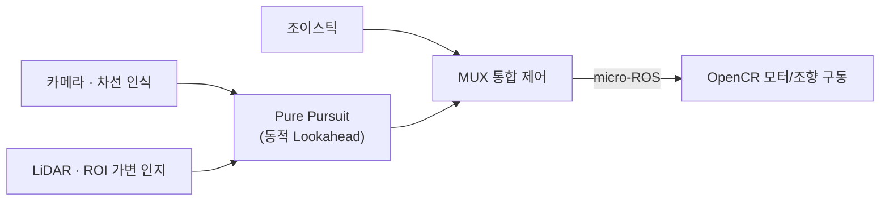

<!--
사용 방법:
1) GitHub에서 자기 계정명과 동일한 이름의 새 저장소를 만듭니다. 예) GeonHoong/GeonHoong
2) 그 저장소의 README.md에 이 파일 내용을 그대로 붙여넣으면 프로필 페이지 상단에 표시됩니다.
3) <> 로 표시된 부분(이름/링크/이메일 등)을 본인 정보로 교체하세요.
-->

# 안녕하세요, 김건홍입니다 👋
**하드웨어 × 임베디드 × 실시간 제어**를 다루는 자율주행 엔지니어입니다.

---

## 🧭 About Me

- 🏎️ **1/10 스케일 자율주행 RC카** 프로젝트에서 **하드웨어 설계 총괄 + 실시간 제어 시스템**을 담당했습니다.
- 🔧 Autodesk Inventor로 섀시를 설계하고, ROS 2 ↔ micro-ROS ↔ OpenCR로 이어지는 제어 파이프라인을 직접 구축했습니다.
- 🧠 센서 데이터(카메라/LiDAR)를 실제 모터 명령까지 안전하게 연결하는 **제어 로직·안전 게이팅** 설계에 관심이 많습니다.

---

## 🛠 Tech Stack

---

## 🚀 Featured Project — 1/10 자율주행 RC카

> ROS 2 기반 차선 인식 · LiDAR 인지 · Pure Pursuit 제어를 통합한 자율주행 스택.
> 하드웨어 설계부터 임베디드 모터 제어까지 담당했습니다.

| 담당 영역 | 핵심 내용 |
|---|---|
| **MUX 통합 제어 노드** | 자율주행/조이스틱 명령을 0.6초 타임아웃 기반으로 중재해 50Hz로 단일 명령 발행. 페일세이프 자동 복귀 |
| **micro-ROS(OpenCR) 실시간 모터 제어** | PC(ROS 2) ↔ OpenCR 임베디드 보드를 micro-ROS 시리얼 브리지로 연결한 폐루프 제어 아키텍처 구축 |
| **LiDAR Lookahead 동적 조정 & ROI 가변 제어** | 차선 곡률·속도에 따라 Pure Pursuit Lookahead 거리와 LiDAR 인식 ROI(사각형 ↔ 부채꼴)를 실시간 연동, 근접 위험 시 비상정지 게이팅 |

🔗 프로젝트 저장소: [<repo_url>](<repo_url>)

---

## 📊 GitHub Stats

